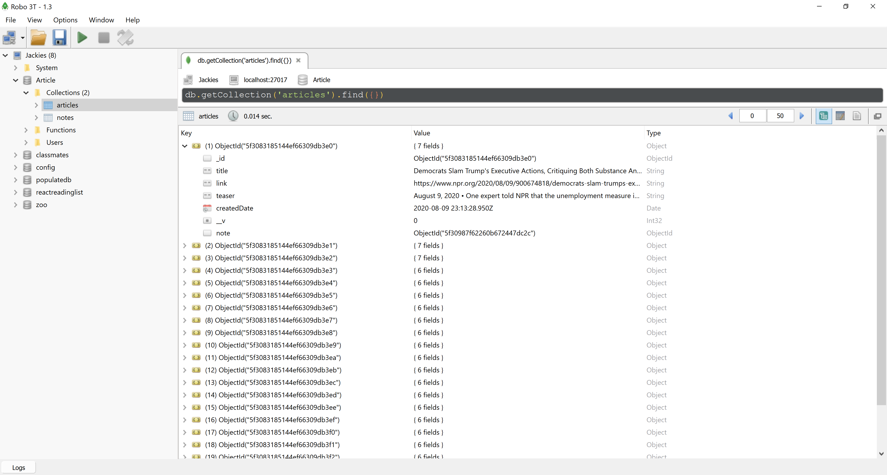
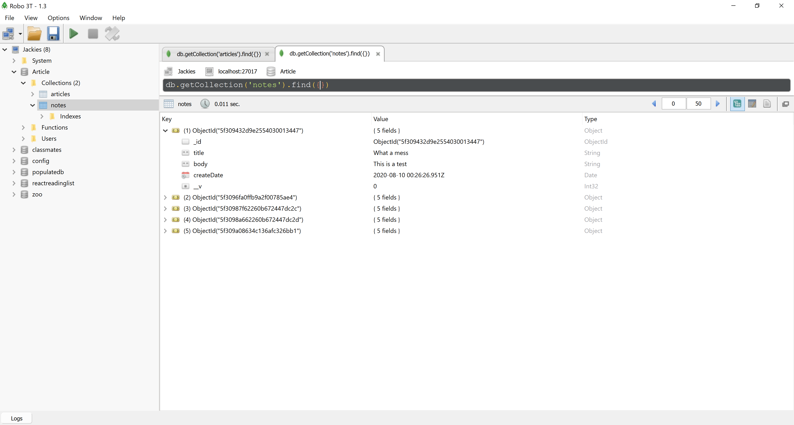

  

# 🍃 npr-mongo 🍃
An application that scrapes articles from the website of NPR and allows you to leave notes. 

## 📝 Description 📝
Link to the site: https://npr-scraper-jg.herokuapp.com/

In this application I created a web application that uses MongoDB to scrape the NPR website. I used MongoDB as the database to store the articles being scraped from NPR's site. Below are images of the database through an application called Robo 3T. 

## 🖥️ Deployment on Heroku 🖥️	
* Prerequisite: If you haven't done so yet, create an account on [Heroku](https://signup.heroku.com/login). 
1. Create a web app on Heroku named npr-scraper-(your initials)
2. Once the app is created, it will go to the Deploy tab where you can connect to your GitHub and use the forked app. 
3. I recommend a manual deploy from your master branch. You will then click deploy. You should receive a message stating "build succeeded"
4. Go to your overview and click on "config add ons".
5. Add mLabs to your configuration. 

## ⛓️ Technologies / Dependencies ⛓️	
* 👾  NPM packages:
     - express
     - mongoose 
     - cheerio 
     - axios 
     - dotenv 
* 👾  Robo 3T
* 👾  jQuery
* 👾  JavaScript
* 👾  HTML 
* 👾  CSS
* 👾  Bootstrap
* 👾  Bootswatch

## 🔗 Links and Resources 🔗
* 💻	  Assistance with declaring defaults in schema [MongooseJS](https://mongoosejs.com/docs/defaults.html#declaring-defaults-in-your-schema) 
* 💻    Help with removing all documents from a collection with [Mongoose](https://stackoverflow.com/questions/28139638/how-can-you-remove-all-documents-from-a-collection-with-mongoose)
* 💻    For news articles on official [NPR site](https://www.npr.org/sections/news/)
* 💻    For [jQuery data attribute](https://www.codegrepper.com/code-examples/javascript/jquery+get+data+attribute)
* 💻    Connecting [Mongo DB](https://www.mongodb.com/blog/post/quick-start-nodejs-mongodb--how-to-get-connected-to-your-database) through the terminal

